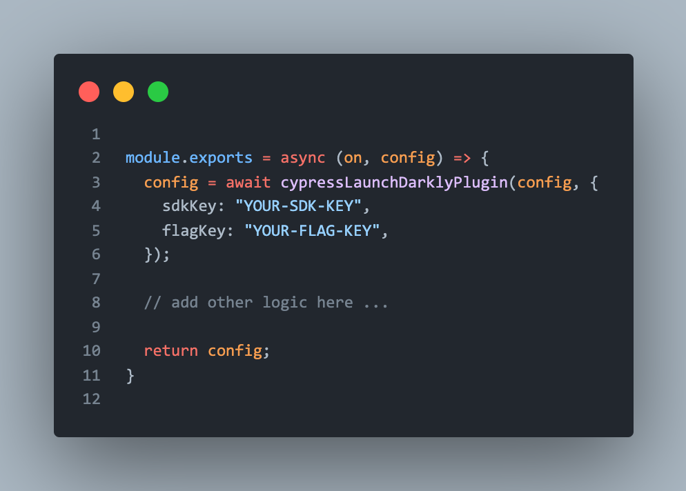

# LaunchDarkly Cypress test filter

> Filter cypress test files using LaunchDarkly feature flags

**Required**: You need a LaunchDarkly account to use this plugin. Don't already have one? click [here](https://app.launchdarkly.com) to create one.

## Install

TODO: Add installation instructions after plublishing to npm

### Plugin setup

1. Create a flag [LaunchDarkly feature flag](https://docs.launchdarkly.com/guides/best-practices/creating-flags) with a boolean variation. You can call this flag anything you like. Optionally, you can check the `This is a permanent flag` checkbox.

**Optional** You can also create an environment for your Cypress tests.

2. Go to Account settings -> Projects, search for your environment and copy the SDK key for the environment you will be using.

3. Load and register the plugin from your cypress [plugin file](https://on.cypress.io/writing-and-organizing-tests#Plugins-file).

**cypress/plugins/index.js**

Note the `async` keyword on the exported function. Cypress will `await` the results of the Promise returned.

## Filtering your tests

With your flag turned on and returning a default variation of `false`, you can target specific test suites or test files to skip in Cypress.

The plugin retrieves a variation from your flag based on three properties:
- suiteNames - A string of test suite names. `['Integration Suite', 'Actions']`
- testNames - A string array of test names. i.e `['blur off a DOM element', 'check a checkbox or radio element', 'click on a DOM element']`
- filePath - the path including the name of the file being evaluated. i.e '2-advanced-examples/actions.spec.js'

When the flag evaluates to true, all tests in the file will be skipped by Cypress. 

## Debug logs

To see debug logs from this plugin, prefix your Cypress tests with `DEBUG=ld-plugin`. For example `DEBUG=ld-plugin npm run cypress`