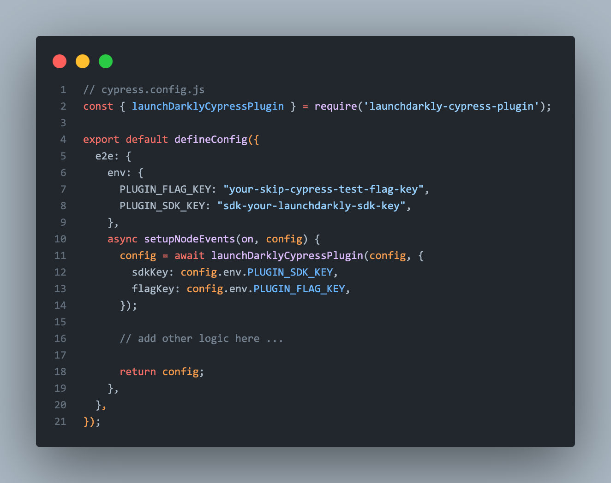
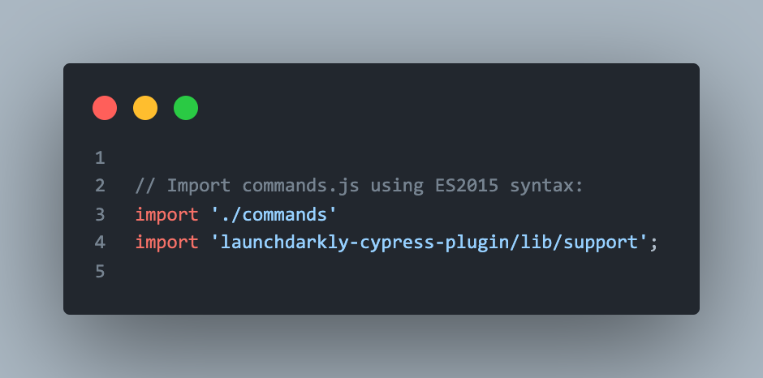
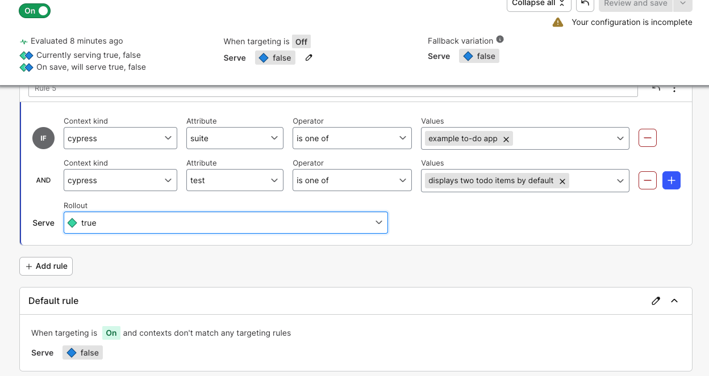

# LaunchDarkly Cypress Plugin (beta)

> Filter cypress tests using LaunchDarkly feature flags

**Required**: You need a LaunchDarkly account to use this plugin. Don't already have one? click [here](https://app.launchdarkly.com) to create one.

## Install

TODO: Add installation instructions after plublishing to npm

### Setup

1. Create a [LaunchDarkly feature flag](https://docs.launchdarkly.com/guides/best-practices/creating-flags) with a boolean variation. You can call this flag anything you like. Optionally, you can check the `This is a permanent flag` checkbox.

**Optional** You can also create an environment for your Cypress tests.

2. Go to Account settings -> Projects, search for your environment and copy the SDK key for the environment you will be using.

3. Load and configure the plugin from your cypress [plugin file](https://on.cypress.io/writing-and-organizing-tests#Plugins-file).

**cypress/plugins/index.js**



Note the `async` keyword on the exported function. Cypress will `await` the results of the Promise returned.

4. Register the support configuration in your cypress support file.

**cypress/support/index.js**



## Skipping your tests

With your flag turned on and returning a default variation of `false`, you can target specific tests or suites using the `suiteName` or `testName` attributes. Additionally, if you configured the plugin with `customAttributes` you can include them in your targeting rules. 

For example, if you configured the plugin as follows:
```typescript
module.exports = async (on, config) => {
  config = await launchDarklyCypressPlugin(config, {
    sdkKey: "YOUR-SDK-KEY",
    flagKey: "YOUR-FLAG-KEY",
    customAttributes: {
      branchName: 'my-github-branch-name'
    }
  });
 
  // add other logic here ...
 
  return config;
}
```

You can include `branchName` in your targeting rules. See example flag configuration below:



When the flag evaluates to true, the matched tests or suites will be skipped by Cypress. See the [Cypress docs](https://docs.cypress.io/guides/core-concepts/writing-and-organizing-tests#Test-statuses) for more details about test statuses.


## Debug logs

To see debug logs from this plugin, prefix your Cypress tests with `DEBUG=ld-plugin`. For example `DEBUG=ld-plugin npm run cypress`

